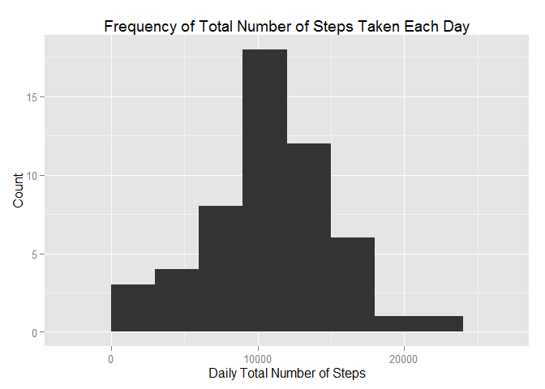
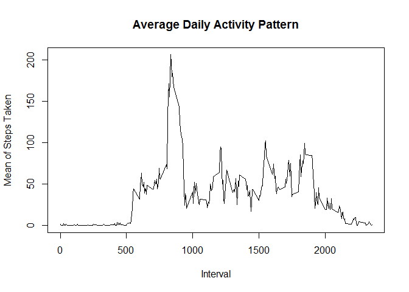
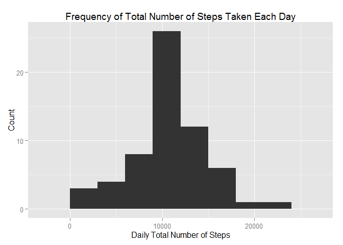
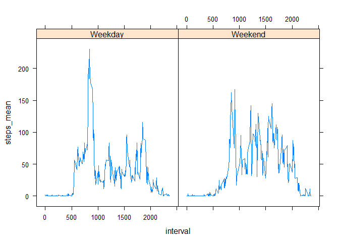

# Reproducible Research: Peer Assessment 1


## Loading and preprocessing the data
The following code snippit deomonstrates that  that the data was downloaded, unzipped and the csv file extracted. The data was loaded into R with no transformations done to the data. The file was most recently downloaded on June 17, 2015

```r
url <- "http://d396qusza40orc.cloudfront.net/repdata%2Fdata%2Factivity.zip"
destination <- "repdata-data-activity.zip"
library(utils)
setInternet2(use = TRUE)
download.file(url, destination)
dataset <- read.csv(unz(destination, "activity.csv"), sep = ",", header = TRUE)
```


## What is mean total number of steps taken per day?
The plyr package is loaded and the dataset is summarized into a new dataset called "dataset1". The data is summarized to calculate the total number of steps taken per day. It's important to note that here and throughout the data analysis, NA values are omitted rather than converted to 0. 

```r
library(plyr)
dataset1 <- ddply(dataset, "date", summarise, steps_tot = sum(steps))
```

The aforementioned summarized dataset is plotted in a histogram. A bun width of 3000 was used for illistrative purposes. 

```r
library(ggplot2)
ggplot() + aes(dataset1$steps) + geom_histogram(binwidth = 3000) + labs(title = "Frequency of Total Number of Steps Taken Each Day") + labs(x = "Daily Total Number of Steps", y = "Count")
```

 

The following is the mean and median of the total number of steps taken per day. Again, NA values are omitted rather than converted to 0.

```r
mean(dataset1$steps_tot, na.rm = TRUE)
```

```
## [1] 10766.19
```

```r
median(dataset1$steps_tot, na.rm = TRUE)
```

```
## [1] 10765
```

## What is the average daily activity pattern?
The plyr package is loaded and the dataset is summarized into a new dataset called "datasets". The data is summarized to calculate the mean number of steps taken per day. Again, NA values are omitted rather than converted to 0. This dataset is plotted using a time series plot of the 5-minute interval (x-axis) and the average number of steps taken, averaged across all days.

```r
dataset2 <- ddply(dataset, "interval", summarise, steps_mean = mean(steps, na.rm = TRUE))
plot(dataset2$interval, dataset2$steps_mean, type = 'l', main = 'Average Daily Activity Pattern', xlab = 'Interval', ylab = 'Mean of Steps Taken')
```

 


The following code calculates the 5-minute interval, on average across all the days in the dataset, contains the maximum number of steps. 

```r
dataset2[which.max(dataset2$steps_mean),1]
```

```
## [1] 835
```

## Imputing missing values
The output below demonstrates the total number of missing values in the dataset, all of which reside in the "steps" variable.  

```r
summary(dataset)
```

```
##      steps                date          interval     
##  Min.   :  0.00   2012-10-01:  288   Min.   :   0.0  
##  1st Qu.:  0.00   2012-10-02:  288   1st Qu.: 588.8  
##  Median :  0.00   2012-10-03:  288   Median :1177.5  
##  Mean   : 37.38   2012-10-04:  288   Mean   :1177.5  
##  3rd Qu.: 12.00   2012-10-05:  288   3rd Qu.:1766.2  
##  Max.   :806.00   2012-10-06:  288   Max.   :2355.0  
##  NA's   :2304     (Other)   :15840
```

The following code generates a new dataset, called "dataset_imp", that fills in the original dataset's missing values. The mean of the respective interval was used as the imputed value. 

```r
dataset_imp <- ddply(dataset, "interval", transform, steps = ifelse(is.na(steps), mean(steps, na.rm=TRUE), steps))
```

The following code snippit generates a dataset that summarizes the total number of steps taken per day with the new imputed dataset. Next a histogram of the total number of steps taken each day with the imputed dataset is plotted and the mean and median total number of steps taken per day are re-calculated. There is virtually no discernible difference between the imputed mean and median, and the original mean and median.  

```r
dataset_imp1 <- ddply(dataset_imp, "date", summarise, steps_sum = sum(steps))
mean(dataset_imp1$steps_sum, na.rm = TRUE)
```

```
## [1] 10766.19
```

```r
median(dataset_imp1$steps_sum, na.rm = TRUE)
```

```
## [1] 10766.19
```

```r
ggplot() + aes(dataset_imp1$steps) + geom_histogram(binwidth = 3000) + labs(title = "Frequency of Total Number of Steps Taken Each Day") + labs(x = "Daily Total Number of Steps", y = "Count")
```

 

## Are there differences in activity patterns between weekdays and weekends?
A new factor variable is created in the imputed dataset with two levels - "Weekday" and "Weekend" indicating whether a given date is a weekday or weekend day.

```r
dataset_imp2 <- mutate(dataset_imp, week = weekdays(as.Date(dataset_imp$date)))
dataset_imp2 <- mutate(dataset_imp2, week = ifelse(dataset_imp2$week == "Saturday" | dataset_imp2$week == "Sunday", "Weekend", "Weekday"))
```

A dataset called "dataset_imp3" is created in order to summarize the average number of steps taken across all weekday days and weekend days. This dataset and the "lattice" package is used to make a panel plot containing a time series plot of the 5-minute interval and the average number of steps taken, divided between the weekend and weekdays. 

```r
dataset_imp3 <- ddply(dataset_imp2, c("week", "interval"), summarise, steps_mean = mean(steps))
library(lattice)
xyplot(steps_mean ~ interval | week, data = dataset_imp3, type = "l")
```

 
